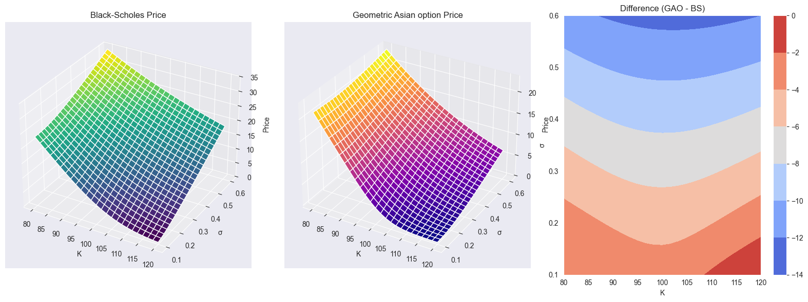
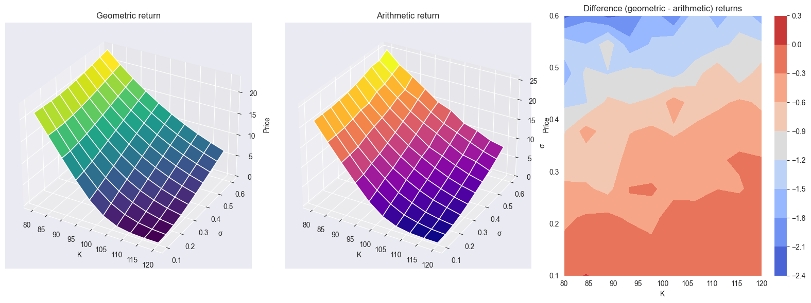
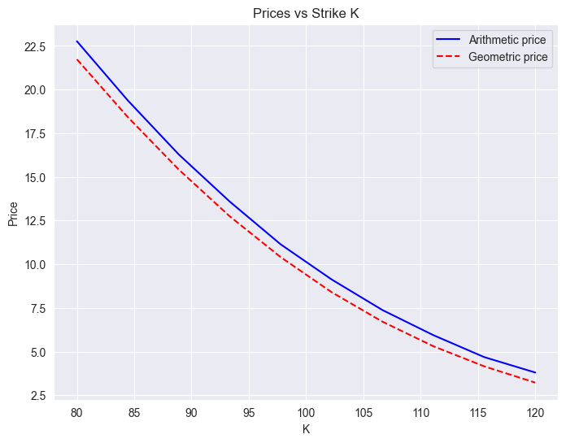
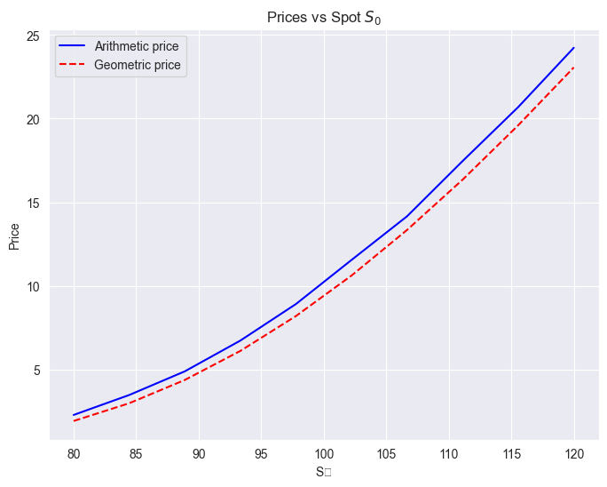
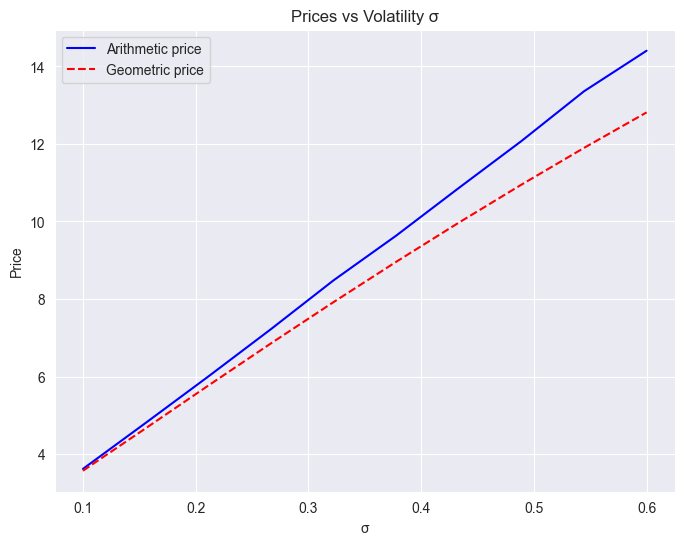

# Asian options: an attempt at pricing and hedging

The goal of this project is to study pricing and hedging of Asian options. Asian options are widely used in commodity, energy, and currency markets because their average-based payoff reduces sensitivity to short-term volatility, manipulation, or illiquidity. This makes them a practical and more stable alternative to standard European-style derivatives.

We implement:
- an analytic model for geometric Asian options (closed-form Black–Scholes solution),
- a Monte Carlo model for arithmetic Asian options, and
- self-financing delta-hedging strategies for both.

Finally, we compare the performance of these models against simulated market conditions and real-world volatility data.

## Asian options basics
Recall that a European call option is a contract whose payoff at expiration is given by $\max(s_t - K, 0)$, where $K$ is the predetermined strike price and $s_t$ is the asset value at expiration time $t$.  By design, European call options are then path-independent, but also susceptible to "last-minute volatility".

Asian call (resp., put) options are an alternative contract trying to address the European option's susceptibility to short-term volatility, by defining the payoff at expiration to be $\max(\bar{S} - K, 0)$ (resp., $\max(K - \bar{S}, 0)$), where $\bar{S}$ is either the arithmetic average of the stock prices $\bar{S} = \frac{1}{N} \sum_{i=1}^N s_{t_i}$ or the geometric average $\bar{S} = \left(\prod_{i=1}^N s_{t_i} \right)^{1/N}$, with $N$ being the number of subdivisions of the time interval $[0,t]$.  This feature makes Asian options especially useful in markets where prices can experience temporary spikes or manipulations near maturity such as commodities and energy or currency markets, or where participants want to smooth exposure to volatility.

The path-dependency of Asian options makes the problem of pricing them particularly interesting.  For one, geometric Asian option has a closed-form solution, while the arithmetic Asian option has not, and so one is naturally led to Monte-Carlo approaches.  Another possibly more interesting feature is that delta-hedging strategies need to take into account this path-dependence, as we will explain below.

## Pricing Asian options
Geometric Asian options have a closed-form pricing formula very similar to the classical Black-Scholes formula for European options.

>**Theorem.** Assume that $S_t$ follows a GBM distribution with yearly volatility $\sigma$.  Assume also that the risk-free interest rate is $r$.  Let $K$ be the strike price and set 
>$$
>b = \frac{1}{2} \left(r - \frac{\sigma^2}{6} \right), \quad d_1 = \sqrt{3}\frac{\log\frac{S_0}{K} + \left(b + \frac{\sigma^2}{6}\right)t}{\sigma\sqrt{t}}, \quad d_2 = d_1 - \frac{\sigma \sqrt{t}}{\sqrt{3}}.
>$$
>Then the fair price for a geometric Asian call option at time $t$ is
>$$
>C_0 = S_0 e^{(b-r)t} \Phi(d_1) - K e^{-rt} \Phi(d_2)
>$$
>and the fair price for a geometric Asian put option at time $t$ is
>$$
>P_0 = K e^{-rt} \Phi(-d_2) - S_0 e^{(b-r)t} \Phi(-d_1),
>$$
>where $\Phi$ is the CDF of the standard normal distribution $\mathcal{N}(0,1)$.
>Moreover,
>$$
>C_0 - P_0 = S_0 e^{(b-r)t} - K e^{-rt}
>$$
>(call-put parity).

We implement a geometric Asian option pricing function in [Notebook 3](03_asian_options.ipynb).

Arithmetic options, on the other side, have no closed-form pricing formulas, and so we need to resort to Monte-Carlo methods for pricing them.  The pricing of arithmetic Asian options is also implemented in [Notebook 3](03_asian_options.ipynb).

### Simulation accuracy
By comparing the analytic and Monte-Carlo option pricing of geometric options, we conclude that a good balance between computational speed and accuracy is achieved between 10,000 and 100,000 simulations.  We use the latter when possible, and resort to small multiples of the former when necessary.

Specifically, for a 1-year call option with spot and strike price of $100.00, interest rate 4.25%, and volatility 0.43, we obtain the following.
```
Computed fair price: $9.78
Estimated call value with 10 simulations: $10.68 with standard error 5.79428
Estimated call value with 100 simulations: $9.88 with standard error 1.44013
Estimated call value with 1000 simulations: $9.52 with standard error 0.52360
Estimated call value with 10000 simulations: $9.93 with standard error 0.16538
Estimated call value with 100000 simulations: $9.70 with standard error 0.05158
Estimated call value with 1000000 simulations: $9.73 with standard error 0.01636
```

### Comparison with Black-Scholes prices
Geometric Asian options have a lower expected return than European options, with the difference increasing with increasing volatility.  They are also, as expected, less susceptible to volatility.



### Comparison between geometric and arithmetic options
Arithmetic options have a higher return than geometric ones, which should be expected since geometric means are bounded above by arithmetic means.

Arithmetic options look also more susceptible to volatility, which can be explained by the fact that geometric averages are more susceptible to small prices and less to large prices than arithmetic averages.  In fact, there seems to be a correlation between the difference in returns and volatility, with difference in returns being higher for higher volatility.








