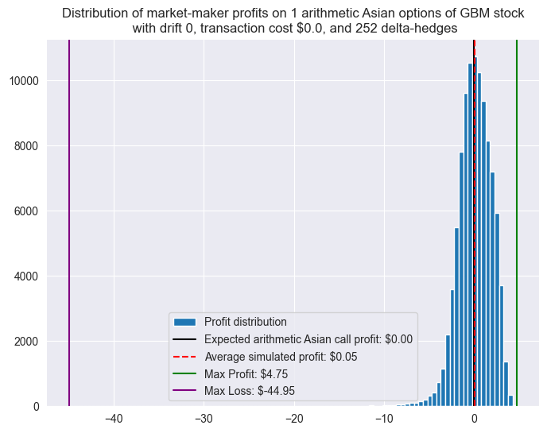
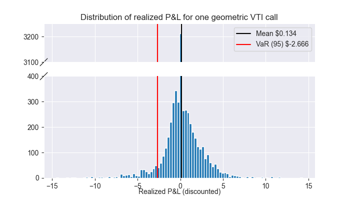

# Asian options: pricing, hedging, and market comparison
**Author.** Roberto Albesiano

**Date.** October 2025

`TL;DR` &rarr; [Executive summary](summary.md)

---

The goal of this project is to study pricing and hedging of [Asian options](https://en.wikipedia.org/wiki/Asian_option). Asian options are widely used in commodity, energy, and currency markets because their average-based payoff reduces sensitivity to short-term volatility, manipulation, or illiquidity, making them a more stable alternative to standard European-style derivatives. For instance, Asian options are often used by airlines to hedge average jet fuel costs over a month.

We implement:
- an analytic model for geometric Asian options pricing,
- a Monte Carlo model for arithmetic Asian options pricing, and
- self-financing delta-hedging strategies for both.

Hedging Asian options in complicated by the path-dependent nature of these financial objects.  Still, albeit imperfect, our hedging strategy is fairly stable with respect to drift, especially in the geometric case. 

We also compare the performance of these models against real-world market data:
- the European options model underprices compared to real-world call quotes,
- the Asian options model seems to be underpricing as well, with an apparent profitability of our pricing model probably due to drift dynamics and imperfections of the model itself.

Below is a detailed explanation of the methodology and the results.


### Index
- [Asian options basics](#asian-options-basics)
- [Pricing Asian options](#pricing-asian-options)
  * [Simulation accuracy](#simulation-accuracy)
  * [Comparison with Black-Scholes prices](#comparison-with-black-scholes-prices)
  * [Comparison between geometric and arithmetic options](#comparison-between-geometric-and-arithmetic-options)
  * [Profit distribution](#profit-distribution)
- [Hedging Asian options](#hedging-asian-options)
  * [Naive hedging](#naive-hedging)
  * [Another attempt at delta-hedging](#another-attempt-at-delta-hedging)
- [Market comparison](#market-comparison)
  * [European options](#european-options)
  * [Asian options](#asian-options)
- [Future directions](#future-directions)


### How to Run
#### Requirements

Install dependencies using:
```bash
pip install -r requirements.txt
```


Packages used:
```
jupyter
matplotlib
seaborn
yfinance
pandas
numpy
scipy
brokenaxes
```

#### Running the notebooks
Each notebook builds on the previous ones, and can be run sequentially:

1. [`01_stock_paths_modeling.ipynb`](01_stock_paths_modeling.ipynb) — Simulates GBM price paths.

2. [`02_european_options.ipynb`](02_european_options.ipynb) — Implements and tests Black–Scholes pricing.

3. [`03_asian_options.ipynb`](03_asian_options.ipynb) — Prices Asian options via analytic and Monte Carlo methods.

4. [`04_asian_hedging.ipynb`](04_asian_hedging.ipynb) — Tests conditional-geometric delta-hedging.

5. [`05_european_market_comparison.ipynb`](05_european_market_comparison.ipynb) — Compares B–S prices with real call quotes.

6. [`06_asian_market_comparison.ipynb`](06_asian_market_comparison.ipynb) — Backtests Asian pricing models using historical data.

Shared utility functions are defined in [`utils.py`](utils.py).

Outputs (dataframes, CSVs, plots) are stored in the [`outputs/`](outputs/) and [`pictures/`](pictures/) folders automatically.


## Asian options basics
Recall that a European call option is a contract whose payoff at expiration is given by $\max(s_t - K, 0)$, where $K$ is the predetermined strike price and $s_t$ is the asset value at expiration time $t$.  By design, European call options are then path-independent, but also susceptible to "last-minute volatility".

Asian call (resp., put) options are an alternative contract trying to address the European option's susceptibility to short-term volatility, by defining the payoff at expiration to be $\max(\bar{S} - K, 0)$ (resp., $\max(K - \bar{S}, 0)$ ), where $\bar{S}$ is either the arithmetic average of the stock prices $\bar{S} = \frac{1}{N} \sum_{i=1}^N s_{t_i}$ or the geometric average $\bar{S} = \left(\prod_{i=1}^N s_{t_i} \right)^{1/N}$, with $N$ being the number of subdivisions of the time interval $[0,t]$.  This feature makes Asian options especially useful in markets where prices can experience temporary spikes or manipulations near maturity such as commodities and energy or currency markets, or where participants want to smooth exposure to volatility.

The path-dependency of Asian options makes the problem of pricing them particularly interesting.  Geometric Asian option has a closed-form solution, while the arithmetic Asian option has not, and so one is naturally led to Monte-Carlo approaches.  Another interesting feature is that delta-hedging strategies need to take into account path-dependence, as we will explain below.

## Pricing Asian options
Geometric Asian options have a closed-form pricing formula very similar to the classical Black-Scholes formula for European options.

>**Theorem.** Assume that $S_t$ follows a GBM distribution with yearly volatility $\sigma$.  Assume also that the risk-free interest rate is $r$.  Let $K$ be the strike price and set 
>
>$b = \frac{1}{2} \left(r - \frac{\sigma^2}{6} \right), \quad d_1 = \sqrt{3}\frac{\log\frac{S_0}{K} + \left(b + \frac{\sigma^2}{6}\right)t}{\sigma\sqrt{t}}, \quad d_2 = d_1 - \frac{\sigma \sqrt{t}}{\sqrt{3}}.$
>
>Then the fair price for a geometric Asian call option at time $t$ is
>
>$C_0 = S_0 e^{(b-r)t} \Phi(d_1) - K e^{-rt} \Phi(d_2)$
>
>and the fair price for a geometric Asian put option at time $t$ is
>
>$P_0 = K e^{-rt} \Phi(-d_2) - S_0 e^{(b-r)t} \Phi(-d_1),$
>
>where $\Phi$ is the CDF of the standard normal distribution $\mathcal{N}(0,1)$.
>Moreover,
>
>$C_0 - P_0 = S_0 e^{(b-r)t} - K e^{-rt}$
>
>(call-put parity).

We implement a geometric Asian option pricing function in [Notebook 3](03_asian_options.ipynb).

Arithmetic options, on the other side, have no closed-form pricing formulas, and so we need to resort to Monte-Carlo methods for pricing them.  The pricing of arithmetic Asian options is also implemented in [Notebook 3](03_asian_options.ipynb).

### Simulation accuracy
By comparing the analytic and Monte-Carlo option pricing of geometric options, we conclude that a decent balance between computational speed and accuracy is achieved between 10,000 and 100,000 simulations.  We use the latter when possible, and resort to small multiples of the former when necessary.

For instance, for a 1-year call option with spot and strike price of $100.00, interest rate 4.25%, and volatility 0.43, we obtain the following.
```
Computed fair price: $9.78
Estimated call value with 10 simulations: $27.37 with standard error 11.17643
Estimated call value with 100 simulations: $8.86 with standard error 1.50809
Estimated call value with 1000 simulations: $10.31 with standard error 0.51988
Estimated call value with 10000 simulations: $9.71 with standard error 0.16294
Estimated call value with 100000 simulations: $9.77 with standard error 0.05150
Estimated call value with 1000000 simulations: $9.78 with standard error 0.01641
```

### Comparison with Black-Scholes prices
Geometric Asian options have a lower expected return than European options, with the difference increasing with increasing volatility.  They are also, as expected, less susceptible to volatility.


### Comparison between geometric and arithmetic options
Arithmetic options have a higher return than geometric ones, which should be expected since geometric means are bounded above by arithmetic means.

Arithmetic options look also more susceptible to volatility, which can be explained by the fact that geometric averages are more susceptible to small prices and less to large prices than arithmetic averages.  In fact, there seems to be a correlation between the difference in returns and volatility, with difference in returns being higher for higher volatility.

>**Note.** In the graph below, the geometric price is computed using the closed-form formula, while the arithmetic price is computed via Monte-Carlo methods.


### Profit distribution
As with European options, the simulated profit distribution of Asian options has mean equal to the expected analytic price (at least for geometric options), but has a very long tail to the right (i.e. very large gains are possible for the option holder).  Below are simulated profit distributions for one 1-year Asian call option with spot and strike prices $100.00, interest rate 4.5%, and volatility 0.4.


A market-maker willing to contrast the chances of unlikely extreme losses then has to resort to delta-hedging.

## Hedging Asian options
Because geometric options have a closed-form solution, we use the formula to compute the delta of geometric options, and use that as a proxy for the delta of arithmetic options as well.  An alternative strategy would be to simulate the delta via Monte-Carlo, by taking small difference quotients, but that is too computationally expensive.

In [Notebook 4](04_asian_hedging.ipynb), using the same notation as before, we find the delta of geometric call options to be 

$\Delta_{C_0} = e^{(b-r)t} \Phi(d_1),$

and the delta for put options to be

$\Delta_{P_0} = \Delta_{C_0} - e^{(b-r)t} = e^{(b-r)t} \left( \Phi(d_1) - 1 \right).$

### Naive hedging
A first naive attempt at hedging Asian options is to just follow the blueprint given by the European option strategy, i.e. by using the formula above to compute delta at every step and use that to rebalance the portfolio.  This however performs rather poorly:


Note that the average simulated profit is always significantly less than the expected profit from the analytic formula.  Running the same simulation with a positive drift $\mu = 0.3$, one instead obtains large gains, suggesting that the hedging strategy is failing somewhere.

In fact, a major issue is that the naive delta-hedging function is discarding the path up to the hedging point, and just computing delta as if the previous history did not matter.  Instead, one should keep track of the path so far, and compute delta conditionally on the (geometric) average up to the point.

One can express the conditional delta in terms of the standard delta with effective parameters.  At time $t_i$:

$\Delta_i(S_{t_i}, G_{t_i}) = \frac{t-t_i}{t} \frac{S_\text{eff}}{S_{t_i}} \Delta_{C_0}(S_\text{eff}, K, \sigma_\text{eff}, t - t_i),$

where $G_{t_i}$ is the geometric average up to time $t_i$, $S_\text{eff} = G_{t_i}^{t_i/t} S_{t_i}^{1 - t_i/t}$ by the properties of geometric averages, and $\sigma_\text{eff} = \sigma \sqrt{\frac{t - t_i}{3t}}$.

Another problem with the naive delta-hedging approach is that it assumes that at each rebalancing step we are taking out or depositing the incremental P&L.  In other words, the portfolio does not have zero cash flow before maturity.  In real world, hedging portfolios instead are self-financing: at each step the portfolio holds $\Delta_i$ shares of stock and $B_i$ of cash/bonds.  Hence, the portfolio value is $V_i = \Delta_i S_i + B_i$.  The bond grows at the risk-free rate, and thus updates as $B_{i+1} = B_i e^{r dt}$, and there is no cash-flow entering or exiting the portfolio at intermediate times.

### Another attempt at delta-hedging
[Notebook 4](04_asian_hedging.ipynb) reimplements the hedging strategy to use conditional deltas in a self-financing portfolio.  The outcome is still a bit off, but not as much as before.  The distribution of profits looks also more regular, and extreme values are less extreme, suggesting a partially working hedging strategy, that is however incomplete, with likely reasons being the mixing continuous geometric average formulas with discrete hedging, and the impossibility to perfectly delta hedge Asian options by only trading the underlying asset.

Below, strike and spot prices are $100.00, the interest rate is 4.5%, yearly volatility is 0.41, and time to expiration is 1 year.


The arithmetic hedging strategy is less precise, as expected given that we are using deltas from the geometric one as proxies.



### Sensibility to drift
We can explore further the dependence on drift of our Asian option hedging strategy, by rerunning the simulation with different amounts of drift.


Note that, albeit imperfect, the geometric hedging strategy is fairly stable with respect to drift, showing a slight positive correlation that gets more pronounced for large values of drift.

In arithmetic hedging, the strategy has more sensibility to the drift term, which should be expected since the delta used is the one of the geometric option.  In particular, larger losses occur, especially with positive drifts.  However, extreme events are quite sparse, and the perfectly balanced portfolio (return of 0) is within one standard deviation from the mean for all drifts.


## Market comparison
In [Notebook 5](05_european_market_comparison.ipynb) and [Notebook 6](06_asian_market_comparison.ipynb), we compare our pricing models with real-world data obtained from `yfinance`.  Ideally, one would compare the price of Asian options obtained from the models described above with real-world quotes of the same options.  However, `yfinance` does not provide prices for Asian options, preventing a direct comparison.

To work around this issue, in [Notebook 5](05_european_market_comparison.ipynb) we first compare Black-Scholes pricing of European calls to real-world call prices from `yfinance`.

Next, in [Notebook 6](06_asian_market_comparison.ipynb), we historically backtest the pricing model for Asian options.  The results for European calls help us interpret the backtest for Asian options.

In both cases, we will look at the following tickers:
- SPDR S&P 500 ETF Trust (`SPY`),
- Vanguard Total Stock Market Index Fund ETF (`VTI`),
- Apple Inc (`AAPL`),
- Microsoft Corp (`MSFT`).

### European options
`yfinance` provides daily data of call prices.  On Friday, October 17, 2025, we obtained the following call prices.


>**Remark.** The analytic geometric Asian option prices are virtually indistinguishable from the arithmetic ones in the graph.

Note how the Black-Scholes prices approximately follow the market price, although they significantly underprice with respect to the market, with the error generally increasing in magnitude as the strike price increases.

Note also how the models give lower prices to the Asian calls, as expected.

From the point of view of market comparison of Asian options, the main takeaway is that, since B-S is underpricing European options compared to market prices, we should expect our Asian pricing models to be underpricing Asian options compared to hypothetical market prices.

### Asian options
In [Notebook 6](06_asian_market_comparison.ipynb), we take windows over historical data and compare the actual discounted payout of an array of Asian calls to the expected one for geometric calls (from the formula) and arithmetic calls (from the Monte-Carlo simulation).  We use realized volatility in the previous month as volatility in the GBM model, since historical data for implied volatility is not available via `yfinance`.

The historical series starts on Jan 1, 2019 and ends on Dec 31, 2024.  We look at options expiring in 5 days, to be consistent with the European options market-comparison.  Averages are taken daily.

Since Asian options are mostly used for commodities, we will also backtest with
- [Invesco Optimum Yield Diversified Commodity Strategy No K-1 ETF](https://etfdb.com/etf/PDBC/#etf-ticker-profile) (`PDBC`),
- [SPDR Gold Shares](https://www.spdrgoldshares.com/) (`GLD`).


#### `SPY`


#### `VTI`



#### `AAPL`


#### `MSFT`


#### `PDBC`


#### `GLD`


Note first that the average P&L is positive in all cases, but recall that the B-S/M-C pricing for European options seems to be systematically underpricing calls compared to their real market prices, which we can assume to be a reasonable proxy for future discounted realized payoffs.  A similar phenomenon is probably happening for Asian options too, and could explain the consistent positive average P&L.  This likely reflects the difference between the risk-neutral dynamics assumed by the model and the empirical dynamics, in particular the presence of a volatility risk premium or deviations from log-normality.

Note also that, although the mean P&L is positive, the distribution is skewed, and the median is practically indistinguishable from 0 and has a very large count.  Moreover, the 95% Value-at-Risk of P&L substantially exceeds the mean in all cases, indicating that the model’s apparent profitability is not statistically or economically significant.

## Future directions
Because of the lack of Asian options data on `yfinance`, we had to resort to historically backtest the model.  Although this gives a reasonable measure of the model performance, it is not yet a complete real-world comparison.  A natural future direction is to obtain Asian options quotes and contrast them directly to our pricing model.

A second direction is to try to improve the Asian pricing model itself.  A natural way would be to replace the simple geometric Brownian motion model with a more sophisticated model such as the Heston or SABR models, likely reducing the underpricing bias.

One should also investigate further how Asian options pricing is done in real-world practice, in particular how averages are computed.

With more computing power, one could also try to improve the arithmetic Asian hedging by replacing the geometric delta with a Monte-Carlo difference quotient approximation.  This last improvement could in fact be extended to geometric hedging as well, since the delta in that case is computed assuming continuous averaging, which is just an approximation of what happens in real markets.

Since any hedging involving only the underlying asset is incomplete, one should also investigate more sophisticated hedging strategies involving other financial instruments.

Finally, since Asian options are mostly used for commodities and currencies, one could expand the analysis in that direction, trying for instance to develop a full case-study where Asian options pricing plays a significant role.