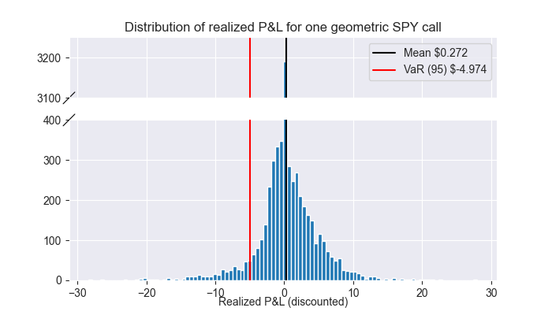

# Asian Options: pricing, hedging, and market comparison

**Author.** Roberto Albesiano

**Date.** October 2025

Asian options are path-dependent derivatives
- widely used in commodities, energy, and currency markets (e.g. airlines for fuel prices),
- with payoff depending on the average of the underlying asset price,
- mitigating short-term volatility and manipulation risk.

| Call type | Payoff |
| --------- | ------------------ |
| European  | $\max(S_T - K, 0)$ |
| Asian     | $\max(\text{average}(S) - K, 0)$ |

The average can be arithmetic or geometric. 
- The geometric case admits a closed-form solution.
- The arithmetic case requires Monte-Carlo simulation.

### This project
- implements analytical pricing for geometric Asian options, Monte-Carlo simulation for arithmetic Asian options under GBM assumptions,
- explore delta-hedging strategies,
- compares model-based results with market data using realized volatilities.

Path dependence complicates hedging, since sensitivity depends on both current and past prices.

## 1. Pricing
**Geometric.** Under GBM dynamics, the average price follows a log-normal distribution.
This gives a closed-form price similar to Black–Scholes, with adjusted volatility and drift:

$C_0 = S_0 e^{(b-r)t} \Phi(d_1) - K e^{-rt} \Phi(d_2)$,

with

$b = \frac{1}{2} \left(r - \frac{\sigma^2}{6} \right), \quad d_1 = \sqrt{3}\frac{\log\frac{S_0}{K} + \left(b + \frac{\sigma^2}{6}\right)t}{\sigma\sqrt{t}}, \quad d_2 = d_1 - \frac{\sigma \sqrt{t}}{\sqrt{3}}.$

**Arithmetic.** Priced by Monte-Carlo simulation: the expected discounted payoff gives the option price.

## 2. Hedging
We use a conditional geometric delta as an approximate hedge for Asian options.
This approach stabilizes the hedged P&L relative to drift, though not perfectly.

>- strike and spot prices: $100.00
>- interest rate: 4.5%
>- yearly volatility: 0.41
>- time to expiration: 1 year
>

## 3. Market Comparison
Because exchange-traded Asian options are scarce, Asian call prices are compared to hypothetical realized payoffs via backtesting.  The analysis uses realized volatility in the 21 days prior.

We compute the P&L distribution of buying calls at the price indicated by our models and holding them to maturity, for one geometric Asian call with 1 week expiry between Jan 1, 2019, and Dec 31, 2024:
| Asset |  Mean P&L | Median  | VaR(95%)
| ----- |  -------- | ---- | --------
| `SPY`   |  +0.272    | 0.000 | -4.974
| `VTI`   |  +0.134    | 0.000 | -2.666
| `AAPL`  |  +0.180    | 0.000 | -2.930
| `MSFT`  |  +0.261    | 0.000 | -5.230
| `PDBC`  |  +0.005    | 0.000 | -0.183
| `GLD`   |  +0.084    | 0.000 | -2.102

## 4. Key findings
A side market comparison for European options guides us in the interpretation of the one for Asian options.
| Observation                              | Interpretation                            |
| ---------------------------------------- | ----------------------------------------- |
| Model prices underprice calls vs. market | Missing volatility risk premium           |
| Mean P&L positive but median about 0     | Apparent profits due to underpricing bias |
| P&L VaR >> mean                          | Model apparent profitability not statistically/economically significant               |
| Drift sensitivity reduced by hedging     | Hedging is imperfect but partially effective     |

## 5. Limitations and future work
| Limitation                             | Proposed direction                                                                                                                                 |
| -------------------------------------------- | -------------------------------------------------------------------------------------------------------------------------------------------------- |
| Lack of real Asian option data               | Obtain OTC or institutional Asian option quotes for a true market comparison                              |
| Realized volatility | Replace with implied volatility obtained from European calls data. |
| Simplified GBM dynamics                      | Replace GBM with Heston or SABR to capture stochastic volatility and reduce systematic underpricing bias.                    |
| Limited understanding of market conventions  | Investigate how averaging conventions and fixing schedules are handled in real-world Asian option contracts.                                       |
| Approximate delta for arithmetic options     | Use Monte-Carlo difference quotient methods to estimate deltas more accurately; apply also to geometric hedging to account for discrete averaging. |
| Incomplete hedging using only the underlying | Explore more complete hedging strategies using additional financial instruments.                                  |
| Limited asset scope                          | Extend the analysis to commodity and FX markets, developing a full case study where Asian options play a more significant practical role.               |
| High computing time | Explore stochastic PDEs methods to replace Monte-Carlo simulations where possible. |
